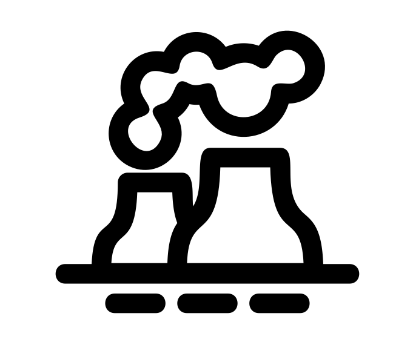

# Air Pollution
This repository contains an analysis of air pollution in Israel, with a focus on Haifa.

Included in the `notebooks and code` folder are two analyses:
1. An exploratory analysis of a custom dataset, comprised of data from 8 years, 5 cities and ~7 pollutants

    A full walkthrough this analysis can be found [here](https://tom-beer.github.io/post/air-pollution-haifa/)
    The relevant notebook is `Exploration.ipynb`
2. Evaluation of Haifa's low emission zone policy on air quality outcomes using synthetic controls
    
    A walkthrough of this evaluation is coming soon..
    The relevant notebook is `Haifa LEZ Synthetic Control.ipynb`

---
logo created by [jokokerto](https://thenounproject.com/search/?q=pollution&i=2983070) from the Noun Project
